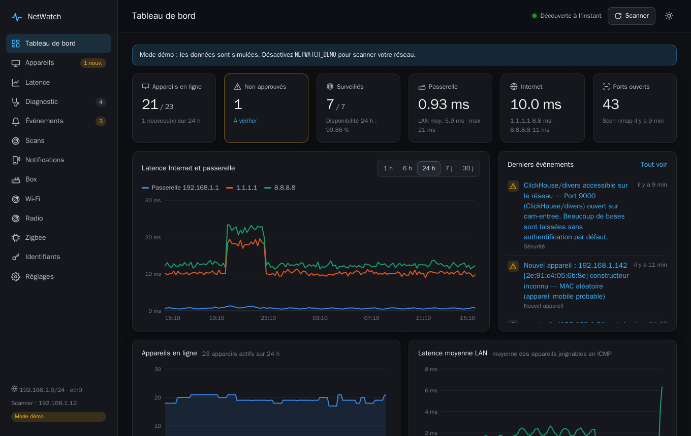
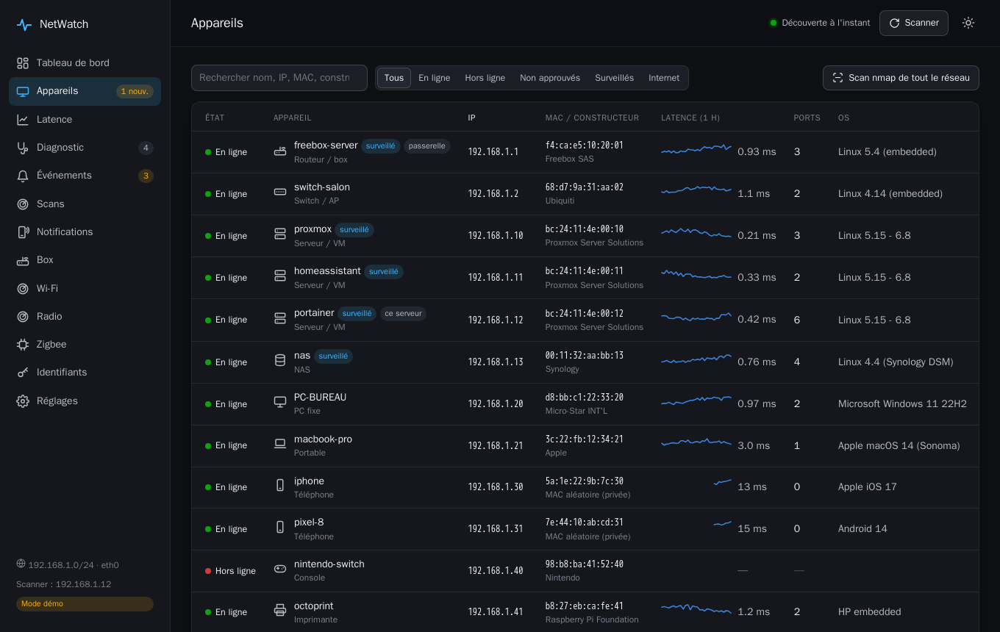
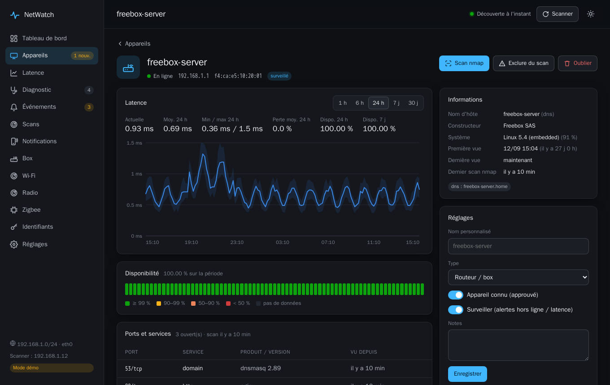
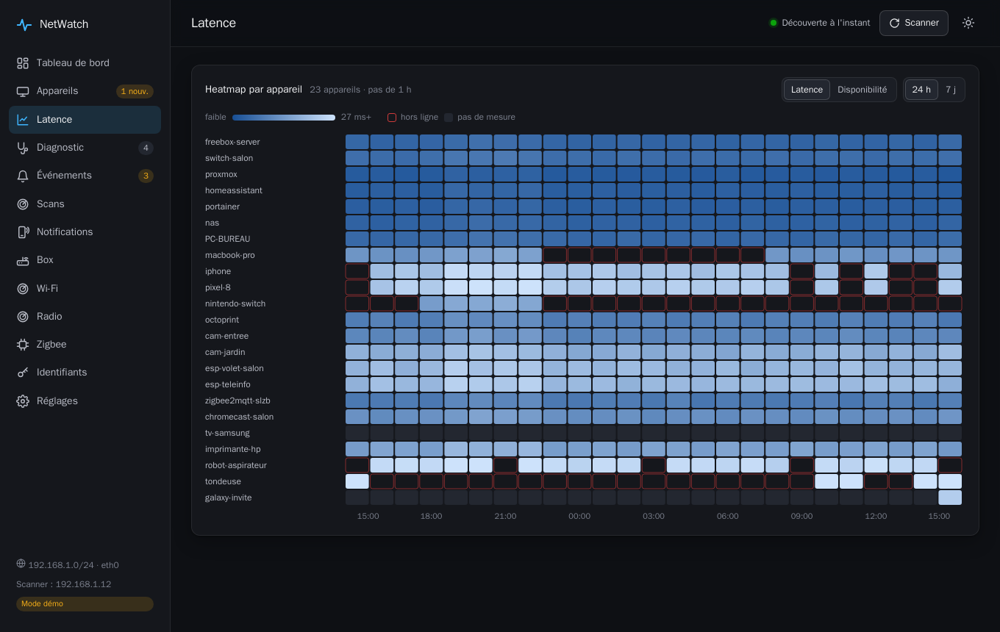
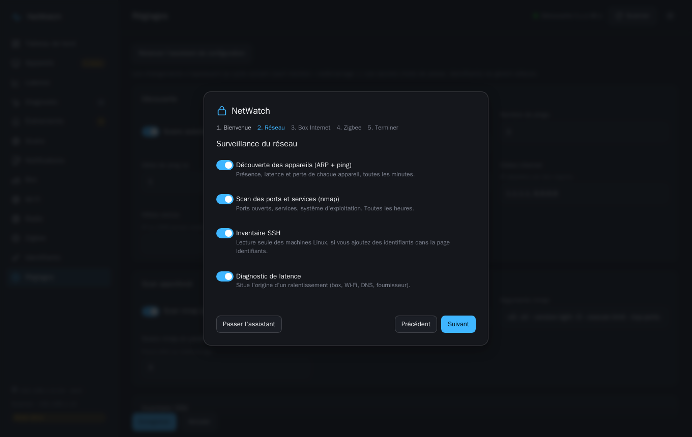

# NetWatch

Supervision réseau domestique auto-hébergée : inventaire des appareils, présence, latence, ports ouverts, box Internet (Bouygues, Free, Orange, SFR), suivi Wi-Fi, Zigbee et alertes, dans une interface web. Tout tient dans un seul conteneur Docker, sans base externe ni compte en ligne.



| Appareils | Fiche d'un appareil |
|---|---|
|  |  |

| Latence et disponibilité | Assistant de configuration |
|---|---|
|  |  |

Captures prises en mode démonstration (données simulées).

## Installation

### Ce qu'il faut

- Une machine **Linux** allumée en permanence et branchée sur votre réseau local : mini-PC, NAS, Raspberry Pi (64 bits), ou une VM (Proxmox, etc.). Un câble Ethernet est préférable au Wi-Fi.
- **Docker** et le greffon **Docker Compose** (`docker compose version` doit répondre).
- Environ 300 Mo de disque pour l'image, puis quelques dizaines de Mo de données.

Docker Desktop sous Windows ou macOS ne convient pas : NetWatch a besoin d'être directement sur le réseau (`network_mode: host`) pour voir les appareils, ce que Docker Desktop ne permet pas. Pour un simple essai de l'interface sur ces systèmes, utilisez le [mode démonstration](#essayer-sans-rien-scanner).

### Installer

```bash
git clone https://github.com/aurelieng2009/netwatch-app.git
cd netwatch-app
```

Ouvrez `docker-compose.yml` et définissez la clé qui chiffre vos mots de passe (box, SSH, MQTT). Retirez le `#` devant la ligne et mettez une longue phrase de votre choix :

```yaml
      NETWATCH_SECRET_KEY: une-longue-phrase-rien-qu-a-vous
```

Notez-la quelque part : sans elle, les mots de passe enregistrés ne sont plus lisibles. Puis lancez :

```bash
docker compose up -d --build
```

La première construction prend quelques minutes. Ouvrez ensuite `http://<adresse-de-la-machine>:8484` depuis un ordinateur ou un téléphone du même réseau.

### Premier démarrage

1. **Créez le compte administrateur** (identifiant et mot de passe de 8 caractères au moins). Faites-le tout de suite : la première personne du réseau local qui ouvre la page le crée.
2. **Suivez l'assistant** : il détecte votre réseau et votre box, et vous laisse choisir ce qui est surveillé (appareils, ports, box Internet, Wi-Fi, Zigbee). Chaque volet se désactive, et l'assistant se relance depuis **Réglages**.
3. **Approuvez vos appareils** dans la page **Appareils**, et marquez « surveillés » ceux dont vous voulez être alerté.
4. Pour recevoir les alertes sur un téléphone, ouvrez NetWatch dessus et activez-les dans **Notifications**. Cela demande un accès en HTTPS, par exemple derrière un reverse proxy.

### Avec Portainer

Créez une stack depuis un dépôt Git : **Stacks → Add stack → Repository**, URL `https://github.com/aurelieng2009/netwatch-app.git`, fichier `docker-compose.yml`. Ajoutez `NETWATCH_SECRET_KEY` dans les variables d'environnement de la stack, puis déployez. L'éditeur web de Portainer ne sait pas construire une image : passez bien par le dépôt.

### Mettre à jour

```bash
cd netwatch-app
git pull
docker compose up -d --build
```

Les données sont conservées (volume `netwatch-data`). Dans Portainer : « Pull and redeploy » sur la stack.

### Sauvegarder, désinstaller

Toutes les données sont dans le volume Docker `netwatch-data` (base SQLite). Pour tout supprimer, données comprises :

```bash
docker compose down -v
```

Sans `-v`, le conteneur est supprimé mais les données restent.

### Essayer sans rien scanner

Dans `docker-compose.yml`, retirez le `#` devant `NETWATCH_DEMO: "true"` : l'interface s'ouvre sur des données simulées, avec 30 jours d'historique, et aucun paquet n'est envoyé sur le réseau. Ce mode fonctionne aussi avec Docker Desktop, à condition de remplacer `network_mode: host` par `ports: ["8484:8484"]`.

### Si quelque chose ne va pas

| Symptôme | Cause probable |
|---|---|
| Aucun appareil trouvé | Le conteneur n'est pas en `network_mode: host`, ou il lui manque les capacités `NET_RAW` et `NET_ADMIN` (le compose fourni les donne). |
| Seule la machine elle-même apparaît | VM en NAT : la carte réseau de la VM doit être sur le pont du réseau local (sous Proxmox, `vmbr0`). Si le pare-feu de l'hyperviseur est actif, autorisez l'ARP et l'ICMP sortants. |
| Appareils d'un autre VLAN absents | L'ARP ne traverse pas les routeurs : NetWatch ne voit que le réseau où il est branché. |
| « Coffre verrouillé » | `NETWATCH_SECRET_KEY` a changé depuis l'enregistrement des mots de passe. Remettez l'ancienne valeur, ou ressaisissez les mots de passe. |
| Page blanche après une mise à jour | Rechargez la page (Ctrl+F5). |
| La box n'est pas reconnue | Choisissez le fournisseur à la main dans la page **Box**, et vérifiez l'adresse de la box dans **Réglages**. |

Les journaux du conteneur disent ce qui se passe : `docker logs netwatch`.

## Fonctionnalités (V1)

| Cadence | Ce qui est fait |
|---|---|
| **Toutes les minutes** | Scan ARP du sous-réseau et ping ICMP (3 paquets) de chaque hôte : présence, latence, perte. Ping des cibles Internet (1.1.1.1 et 8.8.8.8 par défaut). |
| **Pour chaque nouvel appareil, puis toutes les 30 min** | Nom d'hôte obtenu par DNS inverse (la box), mDNS (Apple, Linux/Avahi, ESPHome…) et NetBIOS (Windows/Samba). |
| **Toutes les heures** | `nmap -sS -sV -O` sur les 1000 ports TCP les plus courants : services, versions, OS. |
| **En continu** | Événements et alertes : nouvel appareil, hors ligne / retour, port ouvert ou fermé, latence élevée, changement d'IP. |

Autres éléments :

- Constructeur déduit de l'adresse MAC (base OUI de nmap). Les MAC aléatoires des téléphones sont détectées.
- Interface web : tableau de bord, liste filtrable des appareils avec mini-courbes, fiche par appareil (latence min/moy/max, bande de disponibilité, ports, historique, réglages), heatmap de latence et de disponibilité, journal des événements et des scans. Thème sombre et clair, utilisable sur mobile, mise à jour en temps réel (SSE).
- Chaque appareil peut être **approuvé** (connu) et **surveillé** (alertes hors ligne et latence).
- Notifications via **ntfy** et/ou **MQTT** (Mosquitto → Home Assistant).
- Stockage SQLite : mesures brutes gardées 14 jours, agrégats horaires 400 jours (les deux durées sont configurables).

## Nouveautés V2

| Domaine | Ce qui est ajouté |
|---|---|
| **Inventaire SSH authentifié** | Plusieurs jeux d'identifiants (mot de passe ou clé), **chiffrés au repos** (Fernet) et limités par sous-réseau. Après chaque scan approfondi, NetWatch se connecte en SSH aux hôtes dont le port est ouvert et relève, en lecture seule : OS, noyau, matériel (DMI), CPU/RAM, disques, interfaces (débit, duplex, erreurs, Wi-Fi), voisins ARP, ports en écoute, conteneurs, température, horloge/NTP. La clé d'hôte est **épinglée au premier contact** ; si elle change, la connexion est refusée avant tout envoi de mot de passe. Un identifiant refusé n'est pas réessayé pendant 24 h (anti fail2ban). Les secrets ne ressortent jamais par l'API. |
| **Conflits d'IP** | Détection de deux causes : plusieurs MAC répondant à l'ARP pour une même IP (conflit ou usurpation), et une IP qui « saute » entre MAC (bail DHCP en collision). Alerte `ip_conflict`. |
| **Latence suspecte** | Latence de **référence par appareil** (p25 sur 7 jours). Une latence 5 min très au-dessus de sa normale déclenche `latency_anomaly`, même sous le seuil global. |
| **Diagnostic de latence** | Sonde tout ce qui est mesurable pour situer l'origine d'un ralentissement : ping enrichi (gigue, percentiles), **traceroute** (saut fautif), **découverte du MTU** de chemin, **temps DNS** (en cache et récursif, par résolveur), **connexion TCP** vs ICMP, **bufferbloat** (latence sous charge, note A–F), corrélation des pics entre appareils (cause commune vs isolée) et santé de la machine NetWatch. Produit un **verdict d'origine** (Internet/FAI, box, LAN, Wi-Fi, DNS, bufferbloat, MTU, machine de mesure) et des constats avec suggestions. Planifié toutes les heures, relancé automatiquement en cas d'anomalie généralisée, ou à la demande. |

## Assistant de configuration, box Internet et Wi-Fi

### Assistant de configuration

Au premier accès, juste après la création du compte, un **assistant** demande ce que NetWatch doit surveiller :

1. **Réseau** : découverte des appareils (ARP + ping), scan des ports (nmap), inventaire SSH, diagnostic de latence. Le sous-réseau et la passerelle sont détectés automatiquement.
2. **Box Internet** : détection du fournisseur, saisie des identifiants (ou autorisation par bouton pour Free), suivi Wi-Fi.
3. **Zigbee** : broker MQTT de Zigbee2MQTT, avec un bouton de test.
4. **Récapitulatif**.

Rien n'est imposé : chaque volet se désactive, et l'assistant se relance depuis **Réglages → Relancer l'assistant**. Une installation existante n'est pas interrompue par l'assistant.

### Box Internet (Bouygues, Free, Orange, SFR)

NetWatch lit l'API **locale** de la box (aucun compte en ligne) : état de la ligne, redémarrages, firmware, débit, et surtout **les appareils connectés avec leur point d'accès** (box ou répéteur), leur bande Wi-Fi et leur signal.

| Fournisseur | Accès | Lu | Statut |
|---|---|---|---|
| **Bbox** (Bouygues) | mot de passe d'administration (pas d'identifiant) | ligne, débit, appareils, répéteurs, canaux Wi-Fi | vérifié sur une Bbox Wi-Fi 7 |
| **Freebox** (Free) | autorisation à confirmer sur la façade (aucun mot de passe) | ligne, débit, appareils, répéteurs, canaux Wi-Fi | écrit d'après la documentation officielle, **à valider** |
| **Livebox** (Orange) | « admin » + mot de passe de la box | ligne, débit, appareils | écrit d'après l'interface web de la box, **à valider** |
| **Box SFR** | « admin » + mot de passe de la box | ligne, appareils | écrit d'après l'API de la box, **à valider** |

Les fournisseurs « à valider » n'ont pas encore été essayés sur du matériel réel : si une lecture échoue, la page **Box** la liste sous « Lectures refusées » avec la raison, sans interrompre le reste. Sur une Freebox, certaines lectures (Wi-Fi, répéteurs) demandent d'accorder des droits à l'application NetWatch dans Freebox OS (Paramètres → Gestion des accès → Applications).

Sécurité : les identifiants sont **chiffrés** (Fernet) et ne ressortent jamais par l'API ; la box étant en HTTP ou en HTTPS auto-signé, ils ne sont envoyés qu'à une adresse privée ou à un nom de box connu. Après un refus, NetWatch cesse d'essayer pour ne pas verrouiller la box (jusqu'à ce que les identifiants changent). La session est conservée d'un relevé à l'autre, pour ne pas remplir le journal de la box.

### Suivi Wi-Fi

À chaque relevé, NetWatch note pour chaque appareil Wi-Fi son point d'accès, sa bande et son signal, et tient des **sessions**. Une session se termine par une coupure (l'appareil disparaît de la box), un changement de point d'accès, un changement de bande. La page **Wi-Fi** en tire, par appareil, un diagnostic : coupures malgré un bon signal (réglage ou économie d'énergie), couverture insuffisante, va-et-vient entre box et répéteurs, bascules de bande, appareil joignable ou non pendant qu'il est associé. Elle signale aussi les réglages radio connus pour provoquer des coupures (canal radar DFS, 160 MHz, noms de réseau partagés entre bandes…) et les changements de canal.

### Radio (voisinage Wi-Fi et Zigbee)

Le serveur n'a pas de carte Wi-Fi : un petit agent (`tools/netwatch-wifi-agent.ps1`) tourne sur un PC Windows et envoie la liste des réseaux voisins. La page **Radio** en déduit les canaux 2,4 GHz saturés, le meilleur canal Wi-Fi, et le canal Zigbee qui évite le mieux les points d'accès réellement présents.

### Application mobile (PWA) et notifications push

NetWatch s'installe comme une **application** sur mobile et bureau (Chrome/Edge : menu → « Installer » ; iPhone/iPad : Partager → « Sur l'écran d'accueil »). Une fois installée, elle a sa propre icône et un affichage plein écran.

**Notifications push** (Web Push, sans app tierce) : depuis la page **Notifications**, active les alertes sur chaque appareil et **choisis les types que tu veux recevoir** (nouvel appareil, hors ligne, conflit d'IP, latence suspecte, clé SSH modifiée, port ouvert, diagnostic…). Chaque appareil a son propre filtre. Un bouton **Test** vérifie l'envoi. Les notifications arrivent même quand l'app est fermée (idéal sur Android). Sur iOS, il faut d'abord installer la PWA sur l'écran d'accueil (iOS 16.4+).

Les clés VAPID sont générées automatiquement et gardées en base ; `NETWATCH_VAPID_SUBJECT` (un `mailto:` ou une URL) est optionnel. Le HTTPS est requis (par exemple derrière un reverse proxy).

### Authentification

Accès protégé par **nom d'utilisateur + mot de passe**, avec une vraie page de connexion :

- **Configuration au premier démarrage** : si aucun mot de passe n'est défini, NetWatch affiche un écran « crée ton compte administrateur » au premier accès. Aucune variable d'environnement n'est nécessaire. (Tant que le compte n'est pas créé, l'API reste fermée, et créer le compte n'est possible qu'une fois.)
- Mot de passe **haché** (scrypt) en base, jamais stocké en clair. `NETWATCH_PASSWORD` reste possible pour préconfigurer le mot de passe sans passer par l'écran ; sinon, tout se fait dans l'interface (bouton **compte** en haut à droite pour le changer).
- `NETWATCH_NO_AUTH=true` garde l'interface ouverte sans authentification (comportement V1).

**Connexion biométrique (passkeys / WebAuthn)** : une fois connecté, active la biométrie depuis le bouton **compte** → « Activer la biométrie sur cet appareil ». L'empreinte ou Face ID reste sur l'appareil (le serveur ne garde qu'une clé publique). Ensuite, l'écran de connexion propose **« Se connecter avec la biométrie »**. Plusieurs appareils peuvent être enregistrés. Nécessite HTTPS. Le domaine est déduit de la requête ; `NETWATCH_RP_ID` / `NETWATCH_RP_ORIGIN` permettent de le forcer si besoin.
- **Session par cookie** `HttpOnly` + `SameSite=Strict`, marqué `Secure` derrière un reverse proxy HTTPS. Bouton de **déconnexion**.
- **Limite anti-force-brute** : après 5 échecs, l'IP est bloquée 5 minutes.
- L'**auth HTTP Basic** reste acceptée pour les scripts et l'API (MQTT, curl…).
- Sans mot de passe défini, l'interface reste ouverte (comme en V1) — pense à en définir un.

> Mot de passe oublié ? Redémarre avec `NETWATCH_PASSWORD` (le nouveau) **et** `NETWATCH_PASSWORD_RESET=true`.

Ces fonctions ont besoin des paquets `asyncssh` et `cryptography` (déjà dans `requirements.txt`). Définissez `NETWATCH_SECRET_KEY` pour ne pas stocker la clé de chiffrement dans `/data`. La page **Identifiants** gère les jeux SSH, la page **Diagnostic** montre verdict, constats et conflits.

## Sécurité

**Secrets chiffrés au repos.** Identifiants SSH, mot de passe et jeton de la box, mot de passe MQTT, jeton Home Assistant et clé privée des notifications sont chiffrés en **AES-256-GCM** (chiffrement authentifié, nonce aléatoire par secret). Ils ne ressortent jamais par l'API. La clé est dérivée de `NETWATCH_SECRET_KEY` par scrypt (N=2^16). **Définissez cette variable** (une longue phrase) : sans elle, la clé est générée dans `/data/secret.key`, à côté de la base, et le chiffrement ne protège alors que contre la fuite de la base seule. Les secrets écrits par une ancienne version (AES-128) sont rechiffrés automatiquement au démarrage. Attention : définir ou changer `NETWATCH_SECRET_KEY` sur une installation existante verrouille le coffre ; il faut alors ressaisir les secrets (identifiants SSH, box, MQTT).

Les données de supervision elles-mêmes (inventaire, mesures, événements) ne sont pas chiffrées : la base est un fichier SQLite lisible par le seul utilisateur du conteneur (droits 600). Pour les protéger d'un vol du disque, chiffrez le volume de l'hôte.

**Comptes et sessions.** Mot de passe haché en scrypt (N=2^16, renforcé à la connexion si l'empreinte est ancienne). La base ne garde que le SHA-256 des jetons de session. Cookie `HttpOnly` + `SameSite=Strict`, `Secure` en HTTPS. Après 5 échecs en 5 minutes, l'adresse est bloquée 5 minutes, que l'essai passe par la page de connexion, l'auth Basic, la biométrie ou le changement de mot de passe ; au-delà de 40 échecs toutes adresses confondues, les connexions par mot de passe sont gelées (la biométrie reste possible).

**Derrière un reverse proxy**, déclarez-le dans `NETWATCH_TRUSTED_PROXIES` (IP ou CIDR) : sans cela, tous les visiteurs partagent l'adresse du proxy pour la limitation des tentatives. L'en-tête `X-Forwarded-For` n'est cru que s'il vient d'un proxy de confiance.

**Interface web.** Politique de sécurité du contenu stricte (aucun script en ligne), `X-Frame-Options: DENY` (levé pour les sites listés dans `NETWATCH_FRAME_ANCESTORS`, par exemple un tableau de bord domotique), requêtes limitées à 1 Mo, écritures refusées quand elles viennent d'un autre site. Tout nom venu du réseau (noms d'hôte, SSID, bannières de services) est échappé à l'affichage.

**Garde-fous réseau.** Les réglages ont des bornes, appliquées dans l'interface et au démarrage (variables d'environnement comprises) : découverte au plus toutes les 30 s, 10 pings au plus, 8 scans nmap en parallèle au plus, box interrogée au plus toutes les 30 s, et un sous-réseau de plus de 4096 adresses est restreint à un /22. Les arguments nmap passent par une **liste blanche** : pas de scripts NSE, pas de lecture ou d'écriture de fichiers, pas de cible supplémentaire, pas de `-T5`, débit plafonné.

**Identifiants SSH.** Un mot de passe SSH n'est présenté qu'aux appareils **approuvés** (réglage « Mots de passe SSH réservés aux appareils approuvés ») : un appareil inconnu qui ouvrirait le port 22 ne peut pas le capturer. Les clés ne sont pas concernées. Le test d'un identifiant est limité au réseau surveillé et à la portée de l'identifiant. Préférez une clé et une portée restreinte.

**Limites à connaître.** NetWatch n'a pas de HTTPS intégré : exposez-le derrière un reverse proxy HTTPS, jamais directement sur Internet. Au tout premier démarrage, la première personne qui ouvre l'interface crée le compte administrateur : faites-le aussitôt, ou définissez `NETWATCH_PASSWORD`. Les box Orange, SFR et Free se pilotent en HTTP sur le réseau local, et MQTT n'est pas chiffré : ces mots de passe circulent en clair sur votre LAN.

## Configuration (variables d'environnement)

> 💡 La plupart de ces réglages (intervalles, seuils, cibles, arguments nmap, diagnostic, exclusions…) se modifient aussi **directement dans l'interface**, page **Réglages**, sans redéployer. Les variables d'environnement servent de valeurs initiales ; l'UI a la priorité une fois un réglage enregistré. Les secrets (mots de passe, identifiants) restent hors de cette page.


| Variable | Défaut | Rôle |
|---|---|---|
| `NETWATCH_INTERFACE` | auto | Interface à scanner (celle de la route par défaut si vide) |
| `NETWATCH_SUBNET` | auto | Sous-réseau, ex. `192.168.1.0/24` |
| `NETWATCH_EXTERNAL_TARGETS` | `1.1.1.1,8.8.8.8` | Cibles de latence Internet |
| `NETWATCH_EXCLUDE` | – | Hôtes jamais scannés (ni ARP, ni ping, ni nmap, ni SSH). IP ou CIDR, ex. `192.168.1.1,192.168.1.240/28` |
| `NETWATCH_DISCOVERY_INTERVAL` | `60` | Découverte (s) |
| `NETWATCH_DEEP_INTERVAL` | `3600` | Scan nmap (s) |
| `NETWATCH_NAME_REFRESH_INTERVAL` | `1800` | Rafraîchissement des noms (s) |
| `NETWATCH_NMAP_ARGS` | `-sS -sV --version-light -O --osscan-limit --top-ports 1000 -T4 --host-timeout 300s` | Arguments nmap |
| `NETWATCH_NMAP_CONCURRENCY` | `3` | Scans nmap en parallèle |
| `NETWATCH_PING_COUNT` / `NETWATCH_PING_TIMEOUT` | `3` / `1.0` | Ping |
| `NETWATCH_OFFLINE_AFTER` | `3` | Cycles manqués avant « hors ligne » |
| `NETWATCH_LATENCY_WARN_MS` | `100` | Seuil d'alerte LAN (appareils surveillés, moyenne sur 5 min) |
| `NETWATCH_EXTERNAL_LATENCY_WARN_MS` | `80` | Seuil d'alerte Internet |
| `NETWATCH_LOSS_WARN_PCT` | `50` | Seuil de perte de paquets |
| `NETWATCH_BOX_ENABLED` / `NETWATCH_BOX_HOST` / `NETWATCH_BOX_INTERVAL` | `false` / passerelle / `60` | Supervision de la box Internet (le fournisseur, les identifiants et le suivi Wi-Fi se règlent dans l'interface) |
| `NETWATCH_NTFY_URL` / `NETWATCH_NTFY_TOKEN` | – | Notifications ntfy |
| `NETWATCH_MQTT_HOST` / `_PORT` / `_USER` / `_PASSWORD` / `_PREFIX` | – / 1883 / – / – / `netwatch` | MQTT |
| `NETWATCH_Z2M_ENABLED` / `NETWATCH_Z2M_TOPIC` / `NETWATCH_HA_URL` | `false` / `zigbee2mqtt` / – | Diagnostic Zigbee2MQTT (utilise le broker `NETWATCH_MQTT_*` ; réglable depuis la page Zigbee) |
| `NETWATCH_NOTIFY_TYPES` | `new_device,device_offline,device_online,port_opened,high_latency` | Événements notifiés |
| `NETWATCH_PASSWORD` / `NETWATCH_USERNAME` | – / `admin` | Préconfigure le mot de passe et l'identifiant. Sans mot de passe, un écran de configuration le demande au 1ᵉʳ accès. |
| `NETWATCH_SECRET_KEY` | – | Phrase secrète dont dérive la clé de chiffrement des secrets. **À définir.** |
| `NETWATCH_TRUSTED_PROXIES` | `127.0.0.1,::1` | Proxys inverses dont l'en-tête `X-Forwarded-For` est cru (IP ou CIDR) |
| `NETWATCH_FRAME_ANCESTORS` | – | Sites autorisés à afficher NetWatch dans un cadre (iframe) |
| `NETWATCH_NO_AUTH` | `false` | `true` = interface ouverte, sans authentification (comportement V1) |
| `NETWATCH_PASSWORD_RESET` | `false` | Force la réinitialisation du mot de passe depuis `NETWATCH_PASSWORD` au démarrage |
| `NETWATCH_SESSION_DAYS` | `30` | Durée de validité d'une session (jours) |
| `NETWATCH_SESSION_COOKIE_SECURE` | `auto` | Cookie de session `Secure` : `auto` (selon HTTPS), `true` ou `false` |
| `NETWATCH_PORT` | `8484` | Port de l'interface web |
| `NETWATCH_RAW_RETENTION_DAYS` / `_HOURLY_` / `_EVENT_` | `14` / `400` / `180` | Rétention |
| `NETWATCH_DEMO` | `false` | Mode démonstration |

Pour éviter le bruit, les notifications « hors ligne », « de retour » et « changement d'IP » ne sont envoyées que pour les appareils marqués **surveillés**. Les nouveaux appareils et les nouveaux ports ouverts sont toujours notifiés. Au premier démarrage, l'inventaire initial produit un seul événement récapitulatif au lieu d'une notification par appareil.

## Diagnostic Zigbee2MQTT

La page **Zigbee** se connecte au broker MQTT de Zigbee2MQTT et diagnostique les déconnexions d'appareils sur 6 h, 24 h ou 7 j. Tout se configure depuis la page (broker, identifiants, topic de base) ; le mot de passe MQTT et le jeton Home Assistant sont **chiffrés** par le coffre et ne ressortent jamais par l'API.

**Prérequis côté Zigbee2MQTT** : `availability: true` dans `configuration.yaml`, sinon Z2M ne publie pas l'état en ligne/hors ligne des appareils (la page le signale).

| Collecté (topics `zigbee2mqtt/…`) | Usage |
|---|---|
| `<appareil>/availability` | Chaque passage en ligne / hors ligne, horodaté : déconnexions, durée hors ligne, disponibilité |
| `<appareil>` (états) | LQI et batterie, échantillonnés toutes les 5 min |
| `bridge/state`, `bridge/info` | Pont Zigbee2MQTT en ligne ou non (alerte `z2m_bridge`), version, **canal Zigbee**, coordinateur |
| `bridge/devices` | Inventaire : routeur ou terminal, fabricant, modèle, alimentation |
| `bridge/logging`, `bridge/event` | Erreurs d'envoi (« delivery failed »…), départs du réseau, ré-annonces d'appareils |
| `bridge/response/networkmap` | Carte des liens (bouton manuel : génère du trafic Zigbee) → routeur parent de chaque appareil |

Le **diagnostic** classe les causes probables :

- **Pont arrêté** (plantage ou redémarrage de Zigbee2MQTT) : les changements d'état pendant et juste après sont imputés au pont, pas aux appareils.
- **Coupure de tout le réseau** (plus de 80 % des appareils en même temps) : coordinateur, alimentation ou port USB, broker MQTT.
- **Coupure de groupe** : routeur commun qui lâche (parent identifié si la carte du réseau est disponible) ou interférence.
- **Appareil instable** (taux de déconnexions par 24 h), **lien faible** (LQI moyen < 50), **pile faible**, **erreurs de transmission**, **trop peu de routeurs**, **nœud surchargé** (≥ 20 enfants directs), et **canal Zigbee qui recouvre le Wi-Fi** (recommande 15, 20 ou 25).

Zigbee2MQTT ne conserve aucun historique : NetWatch n'a de données que depuis l'activation du module. Pour diagnostiquer tout de suite les dernières 24 h, le bouton **Importer l'historique** relit celui de Home Assistant (URL locale + jeton d'accès longue durée) : quand un appareil est hors ligne, toutes ses entités passent à `unavailable`. L'import récupère aussi le **nom** de chaque appareil dans Home Assistant (affiché en principal, le nom Zigbee2MQTT en secondaire) et rattache les entités par l'adresse IEEE exacte. Pour les appareils qui n'ont toujours que leur adresse `0x…` comme nom, NetWatch **suggère** un nom déduit de la pièce, du type des entités (ouverture, mouvement, température, lumière…), des automatisations qui les utilisent et du modèle, par exemple « Entrée – présence » : marqué « déduit » avec ses indices et un niveau de confiance, jamais présenté comme un vrai nom. À défaut, les entités sont associées à leur appareil par son nom ou par son adresse IEEE ; un redémarrage de HA ressemble à une coupure globale (la page l'indique quand la source est HA).

## Intégration Home Assistant (MQTT)

**Découverte automatique (recommandé)** : si `NETWATCH_MQTT_HOST` est défini, NetWatch publie la configuration MQTT Discovery de chaque appareil **surveillé** (`watch=1`). Ils apparaissent tout seuls dans Home Assistant — un capteur de **connectivité** (en ligne/hors ligne) et un capteur de **latence** par appareil, regroupés sous un « appareil » HA avec constructeur et modèle. Marque un appareil comme surveillé dans NetWatch et il arrive dans HA ; enlève-le et l'entité disparaît. Réglages : `NETWATCH_MQTT_DISCOVERY` (`true` par défaut) et `NETWATCH_MQTT_DISCOVERY_PREFIX` (`homeassistant`).

NetWatch publie aussi :

- `netwatch/events` : chaque événement, en JSON (`type`, `severity`, `message`, `device`…)
- `netwatch/device/<mac sans :>/state` (retain) : `{"online": true, "latency_ms": 1.2, "ip": ..., "name": ...}` pour les appareils en ligne ou surveillés.

Configuration **manuelle** d'un capteur (si tu n'utilises pas la découverte), dans `configuration.yaml` :

```yaml
mqtt:
  binary_sensor:
    - name: "NAS en ligne"
      state_topic: "netwatch/device/001132aabb13/state"
      value_template: "{{ 'ON' if value_json.online else 'OFF' }}"
      device_class: connectivity
  sensor:
    - name: "Latence NAS"
      state_topic: "netwatch/device/001132aabb13/state"
      value_template: "{{ value_json.latency_ms }}"
      unit_of_measurement: "ms"
```

## API

Tout ce qu'affiche l'interface est accessible en JSON : `/api/overview`, `/api/devices`, `/api/devices/{id}`, `/api/devices/{id}/metrics?range=1h|6h|24h|7d|30d|90d|365d`, `/api/heatmap?range=24h|7d`, `/api/events`, `/api/scans`, `POST /api/scan/discovery`, `POST /api/scan/deep`, `POST /api/devices/{id}/scan`, `PATCH /api/devices/{id}` (`alias`, `dev_type`, `known`, `watch`, `notes`), flux temps réel `/api/stream` (SSE).

## Architecture

```
app/
  arp.py        scan ARP en Python pur (AF_PACKET), MAC multiples par IP (conflits)
  icmp.py       ping multi-cibles, gigue, traceroute, MTU de chemin (raw ou DGRAM)
  names.py      DNS inverse, mDNS unicast, NetBIOS (requêtes forgées à la main)
  nmapscan.py   nmap -oX + parsing XML
  vault.py      coffre des identifiants SSH, chiffrés au repos (Fernet)
  sshscan.py    inventaire SSH lecture seule, clé d'hôte épinglée (TOFU)
  sshinv.py     sélection d'identifiants, anti fail2ban, enregistrement
  probes.py     sondes actives : TCP connect, DNS chronométré, bufferbloat
  diagnostics.py analyse pure : traceroute, corrélation des pics, verdict
  diagrun.py    orchestration d'un diagnostic complet
  engine.py     planification, inventaire, événements, alertes, file nmap
  backends.py   backend réel + backend démo (simulation)
  db.py         SQLite WAL, agrégats horaires, rétention, migrations
  notify.py     ntfy + client MQTT minimal
  mqttsub.py    client MQTT abonné (asyncio, reconnexion)
  box.py        moniteur de la box Internet : identifiants chiffrés, relevé périodique, événements, débit
  boxes/        fournisseurs : bouygues.py, freebox.py, livebox.py, sfr.py (+ base.py : client HTTP, détection)
  wifi.py       suivi des sessions Wi-Fi, diagnostic par appareil, réglages radio
  airscan.py    voisinage Wi-Fi (agent PC) et choix du canal Zigbee
  z2m.py        écoute Zigbee2MQTT : disponibilité, LQI, journal, carte du réseau
  z2mdiag.py    analyse pure : coupures groupées, causes, constats
  z2mnames.py   suggestion de noms pour les appareils sans nom (pièce, entités, automatisations)
  hahistory.py  import de l'historique de disponibilité et des noms depuis Home Assistant
  auth.py       mot de passe haché (scrypt), sessions, anti-force-brute
  api.py        API Starlette, SSE, connexion par session (+ Basic pour l'API)
web/            SPA sans étape de build (JS natif + graphiques SVG maison)
tests/          python -m unittest discover -s tests
```

Le choix de ne dépendre d'aucune lib réseau (scapy, etc.) garde l'image légère et la surface d'attaque minimale. Le conteneur consomme très peu : un cycle de découverte prend quelques secondes par minute.

## Feuille de route (au-delà de la V2)

- Inventaire SNMP v2c/v3 (imprimantes, switches, onduleurs) en complément du SSH.
- Valider les fournisseurs Free, Orange et SFR sur du matériel réel ; débit par appareil quand la box l'expose.
- Multi-VLAN, découverte MQTT pour Home Assistant, export Prometheus.

## Licence

NetWatch est distribué sous licence MIT (voir [LICENSE](LICENSE)).

N'utilisez NetWatch que sur un réseau qui vous appartient ou que vous êtes autorisé à surveiller : il effectue des scans de ports.
